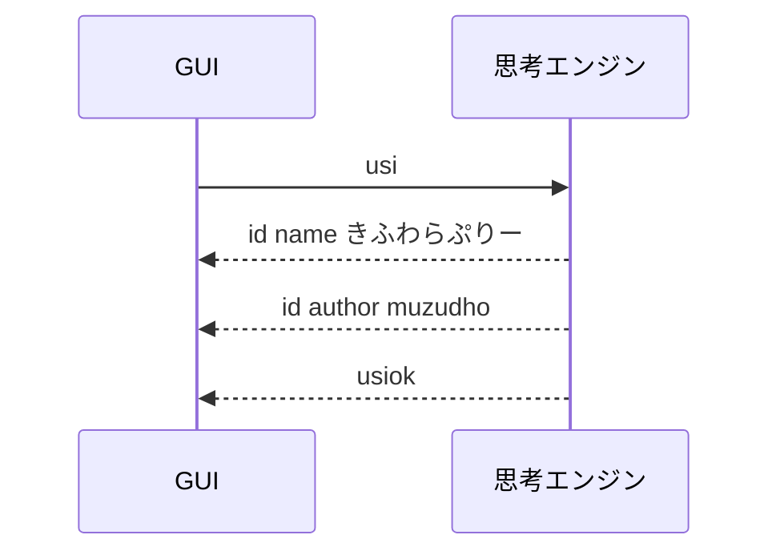
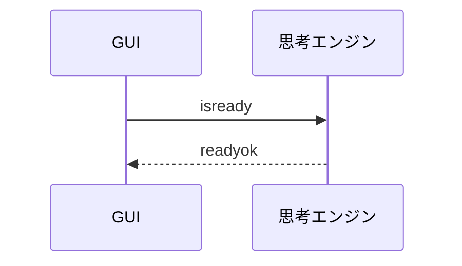
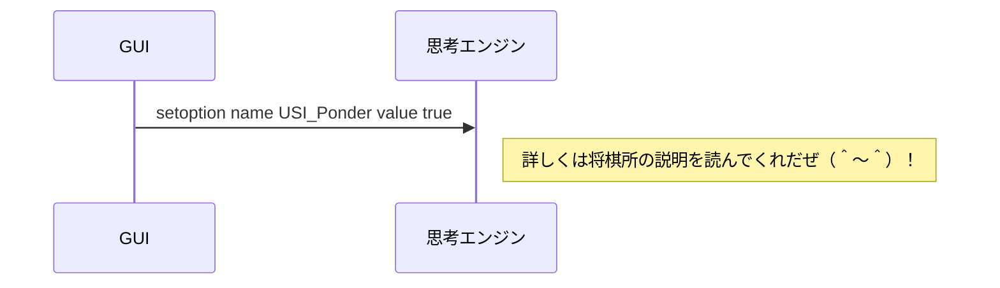
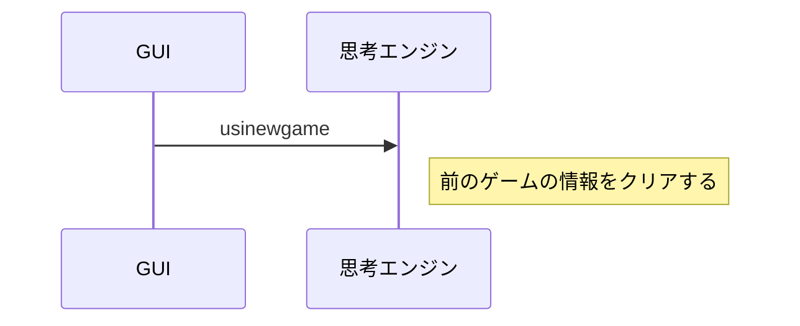
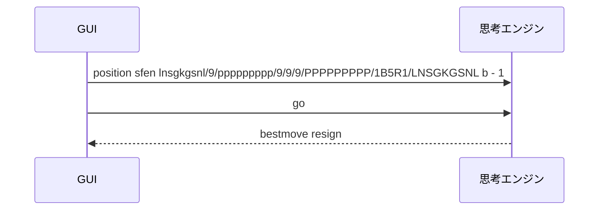
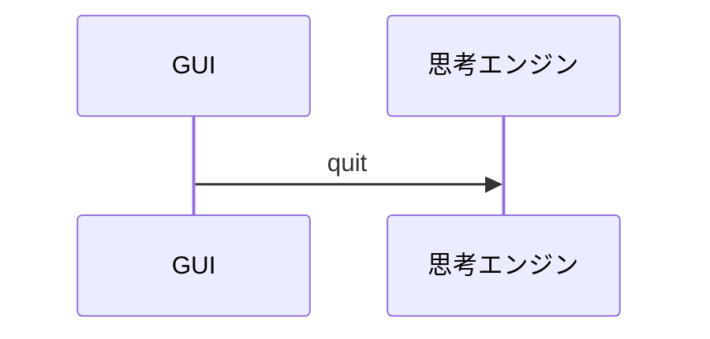

# コマンド例

## USIプロトコル

👇　下記の［USIプロトコル］を実装したいんだぜ（＾▽＾）！  
📖 [将棋所　＞　USIプロトコルとは](https://shogidokoro2.stars.ne.jp/usi.html)  

標準出力は、将棋エンジンから GUI への通信に使うぜ（＾▽＾）！  
タイムスタンプなどの、余計な装飾は付けないでくれだぜ（＾▽＾）！  

標準エラー出力は使ってもいいが、仕様にないので、あんま使いたくないぜ（＾～＾）  


### 起動時




### 準備確認




### オプション設定（任意）




### 新しいゲームの開始




### 局面を設定して指し手を求める




### 終了




## 独自コマンド例

USI プロトコルには無いが、学習やデバッグのために独自コマンドを追加してもいいぜ（＾～＾）  
このプロジェクトでは、今のところ次のようなコマンドがあるぜ（＾～＾）

```shell
help
```

👆　独自コマンド一覧を表示するぜ（＾▽＾）！  

```shell
show board
```

👆　現在の盤面をコンソールに表示するぜ（＾▽＾）！  
`pos` という短い名前も考えられるが、`position` と紛らわしいので、`show board` にしているぜ（＾～＾）  

```shell
clear
```

👆　コンソール画面を消すぜ（＾▽＾）！  


## 命名メモ

独自コマンド名は、次の方針で付けると読みやすいぜ（＾～＾）

- 動詞 + 対象
- USI 標準コマンドと紛らわしくしない
- 略しすぎない

詳しくは下記メモを読んでくれだぜ（＾～＾）

- [📄 ../../Docs/6_独自コマンド命名ルール案.md](../../Docs/6_独自コマンド命名ルール案.md)
