# コマンド例

## USIプロトコル

👇　下記の［USIプロトコル］を実装したいんだぜ（＾▽＾）！  
📖 [将棋所　＞　USIプロトコルとは](https://shogidokoro2.stars.ne.jp/usi.html)  

標準出力は、将棋エンジンから GUI への通信に使うぜ（＾▽＾）！  
タイムスタンプなどの、余計な装飾は付けないでくれだぜ（＾▽＾）！  

標準エラー出力は使ってもいいが、仕様にないので、あんま使いたくないぜ（＾～＾）  


### 起動時

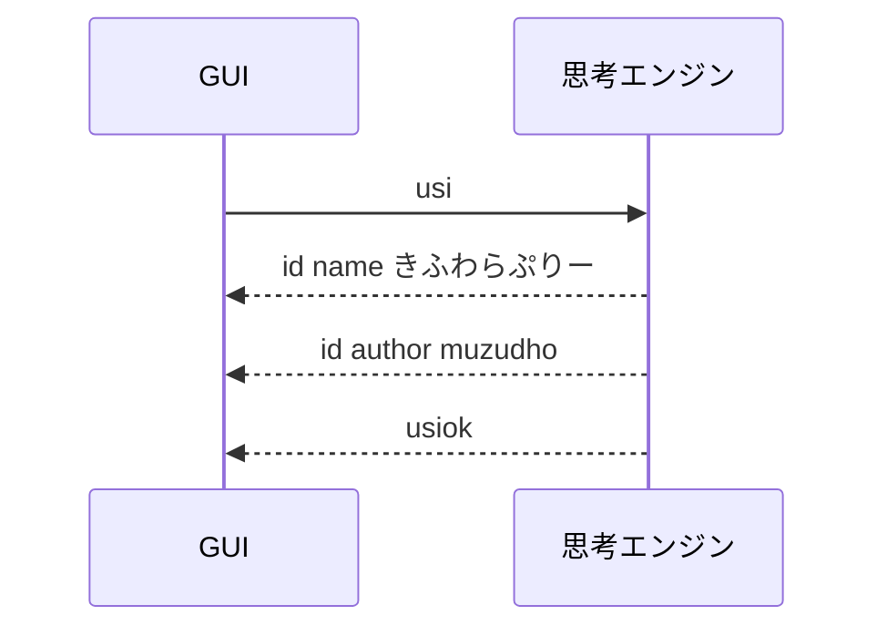


### 準備確認

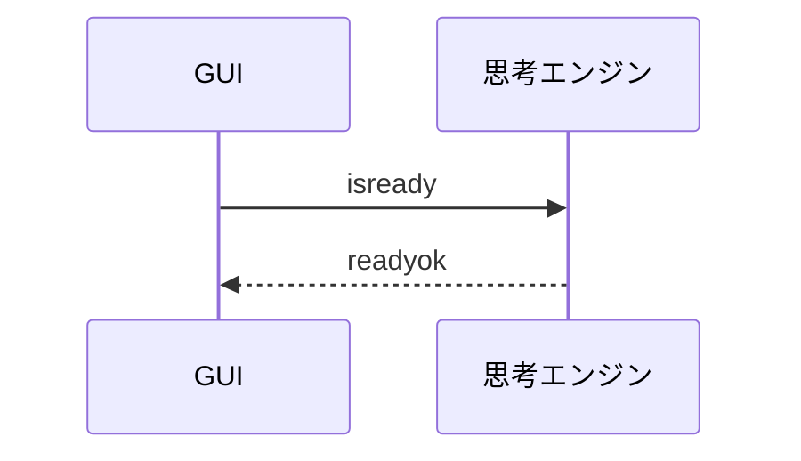


### オプション設定（任意）

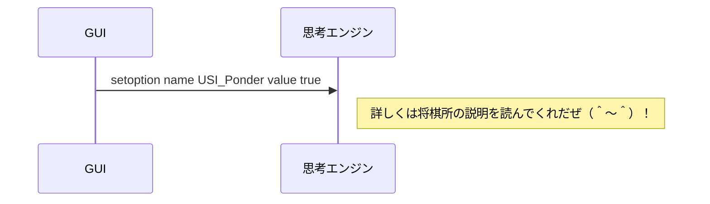


### 新しいゲームの開始

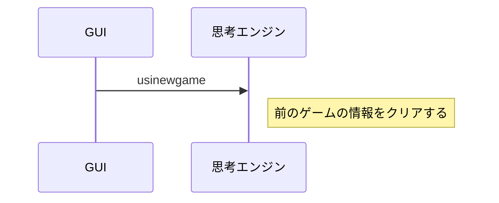


### 局面を設定して指し手を求める

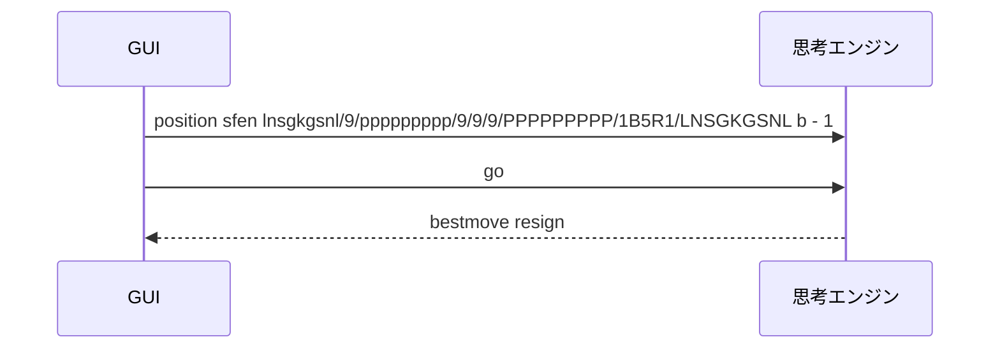

`position` と `go` は、対局中にいちばんよく使う中核コマンドだぜ（＾▽＾）！  
GUI はまず局面を `position` でエンジンへ伝えて、そのあと `go` で思考開始を指示するぜ（＾～＾）


#### position コマンド

基本形は次の 2 種類だぜ（＾▽＾）！

```text
position startpos
position sfen <sfen文字列>
```

さらに、途中の指し手を続けて渡したいときは `moves` を付けるぜ（＾▽＾）！

```text
position startpos moves 7g7f 3c3d 2g2f
position sfen lnsgkgsnl/9/ppppppppp/9/9/9/PPPPPPPPP/1B5R1/LNSGKGSNL b - 1 moves 7g7f 8c8d
```

- `startpos` は平手初期局面だぜ
- `sfen` は任意局面を文字列で渡す形式だぜ
- `moves` 以降は、USI 形式の指し手を半角スペース区切りで並べるぜ
- エンジン側は、受け取った内容で内部局面を再構築してから思考に入るぜ


#### startpos を使う場合

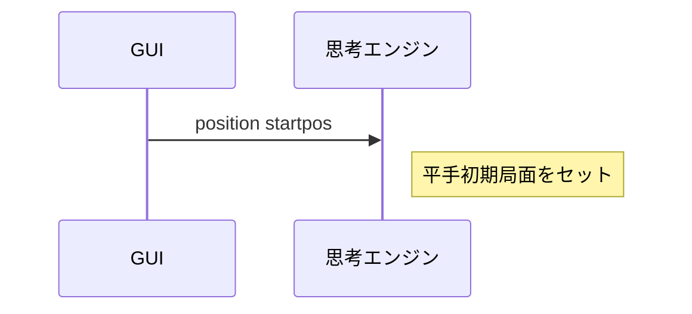


#### startpos moves を使う場合

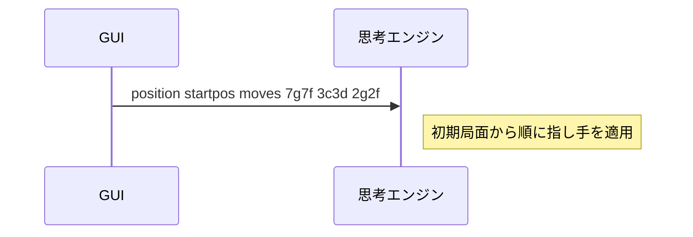


#### sfen を使う場合

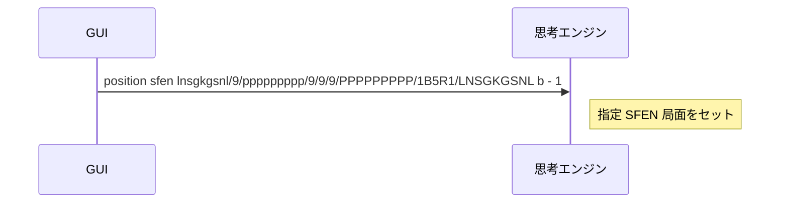


#### go コマンド

`go` は「この条件で思考を始めてくれ」という指示だぜ（＾▽＾）！

よく使う形は例えばこんな感じだぜ（＾～＾）

```text
go
go depth 1
go movetime 1000
go btime 600000 wtime 600000 byoyomi 10000
```

- `go` だけなら、とりあえず思考開始だぜ
- `depth 1` は 1 手先まで読む、みたいな深さ指定だぜ
- `movetime 1000` は 1000 ミリ秒だけ考える指定だぜ
- `btime` `wtime` `byoyomi` は持ち時間と秒読みを渡す形式だぜ

エンジンは思考中、必要なら途中経過を `info` で返せるぜ（＾▽＾）！  
最後に必ず `bestmove` を返して思考終了だぜ（＾～＾）


#### go depth

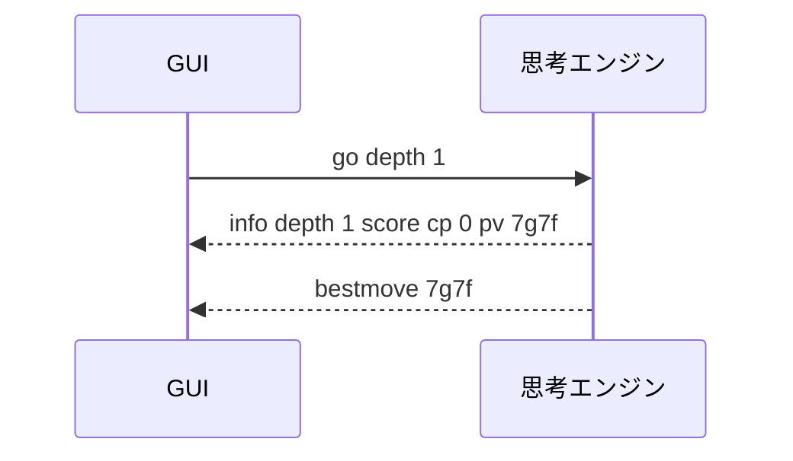


#### go movetime

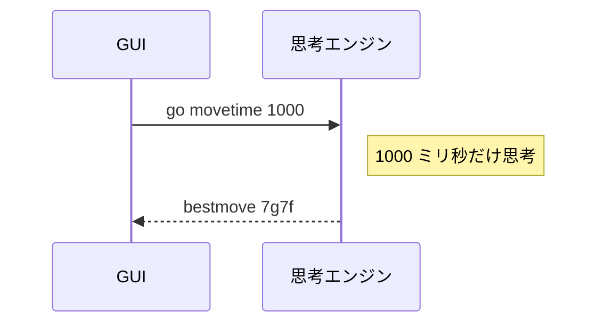


#### go btime / wtime / byoyomi

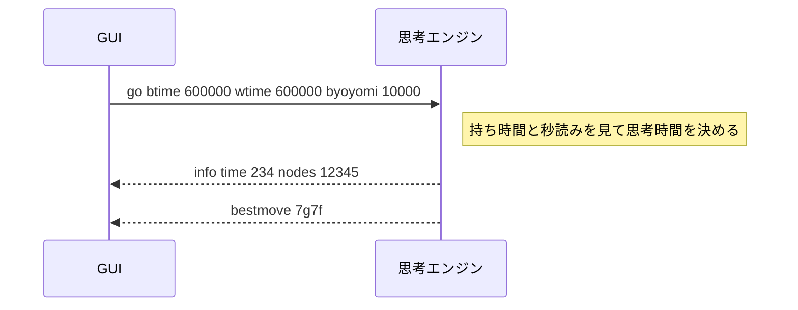


#### info コマンド

`info` は GUI から送るコマンドではなく、思考エンジンが途中経過を GUI へ知らせるための出力だぜ（＾▽＾）！

```text
info depth 1 score cp 0 pv 7g7f
info time 234 nodes 12345 nps 52756 pv 7g7f 3c3d
```

- `depth` は探索の深さだぜ
- `score cp 0` は評価値だぜ。`cp` は centipawn の略だぜ
- `pv` はいま最善と見ている読み筋だぜ
- `time` `nodes` `nps` は思考量の目安だぜ


#### bestmove コマンド

思考が終わったら、最後に `bestmove` を返すぜ（＾▽＾）！

```text
bestmove 7g7f
bestmove resign
bestmove win
```

- `bestmove 7g7f` は、その手を指すという意味だぜ
- `bestmove resign` は投了だぜ
- `bestmove win` は勝ち宣言だぜ


#### stop コマンド

GUI は、思考中のエンジンに `stop` を送って思考打ち切りを指示できるぜ（＾▽＾）！

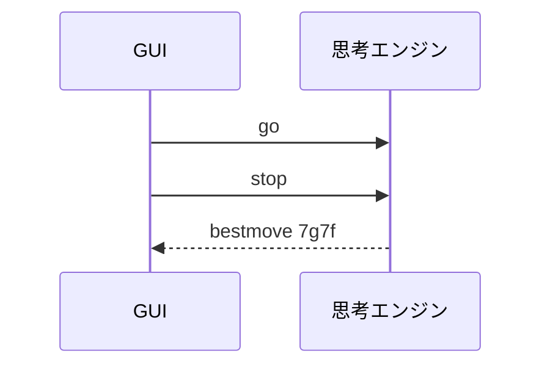

`stop` を受け取ったら、エンジンはできるだけ早く `bestmove` を返すのが大事だぜ（＾～＾）


#### ponderhit は今は後回しでもよさそう

`go ponder` や `ponderhit` まで入れると少し難しくなるので、最初の実装では後回しでもいいと思うぜ（＾～＾）  
まずは `position` / `go` / `stop` / `bestmove` をしっかり押さえるのが分かりやすいぜ（＾▽＾）！


### 終了

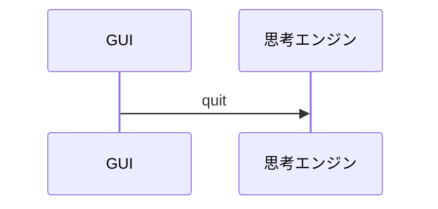


## 独自コマンド例

USI プロトコルには無いが、学習やデバッグのために独自コマンドを追加してもいいぜ（＾～＾）  
このプロジェクトでは、今のところ次のようなコマンドがあるぜ（＾～＾）

```shell
help
```

👆　独自コマンド一覧を表示するぜ（＾▽＾）！  

```shell
show board
```

👆　現在の盤面をコンソールに表示するぜ（＾▽＾）！  
`pos` という短い名前も考えられるが、`position` と紛らわしいので、`show board` にしているぜ（＾～＾）  

```shell
clear
```

👆　コンソール画面を消すぜ（＾▽＾）！  


## 命名メモ

独自コマンド名は、次の方針で付けると読みやすいぜ（＾～＾）

- 動詞 + 対象
- USI 標準コマンドと紛らわしくしない
- 略しすぎない

詳しくは下記メモを読んでくれだぜ（＾～＾）

- [📄 ../../Docs/6_独自コマンド命名ルール案.md](../../Docs/6_独自コマンド命名ルール案.md)
