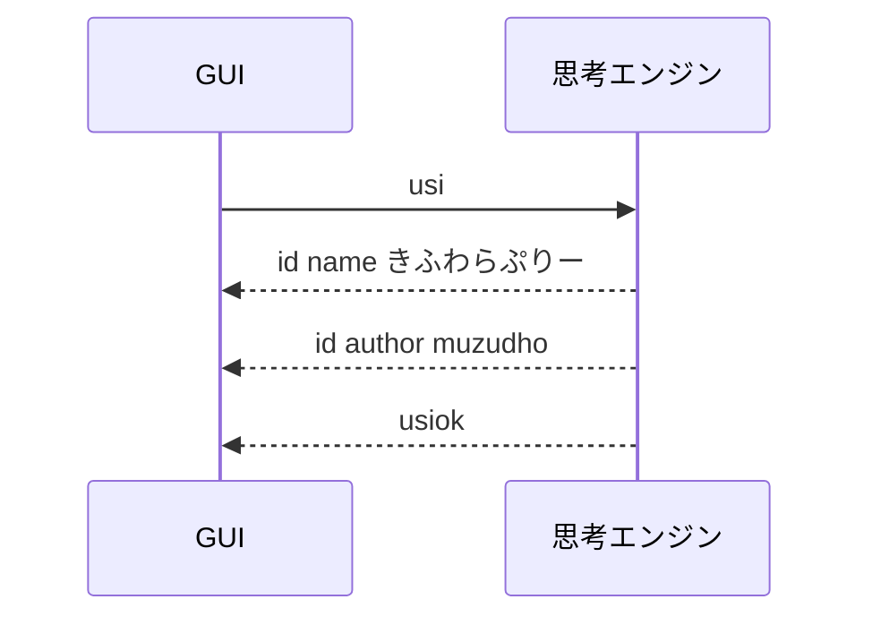

# はじめに

このフォルダーは、 KifuwarabeShogiCSharp プロジェクトの説明をまとめたものです。  

KifuwarabeShogiCSharp プロジェクトは、［強い将棋ソフトを目指す］ことではなく、［多様性のある将棋関連のソフトを作るためのオープンなエントリーモデルになる］ことを目指すものです。  

## Visual Studio 2026 のセットアップ

* `Mermaid Editor for Visual Studio` （NeVeSさん作）拡張を入れてください。
    * メインメニュの［拡張機能］→［拡張機能の管理］からインストールできます。
    * `*.md` ファイルに、Mermaid 形式の図を描けるようになります。`*.md` ファイルを開いて、右クリックして「Markdown のプレビュー表示」を選ぶと、Mermaid 形式の図が見れるようになります。

例：  

## リンク

* コンソールアプリケーション描画ライブラリ
    * 📁 `Lib/HelloConsoleAppCSharp.Core.dll`
        * コンソールにアプリケーション画面を描画するためのライブラリです。
        * 説明書： 📖 [muzudho / HelloConsoleAppCSharp](https://github.com/muzudho/HelloConsoleAppCSharp)
* このプロジェクトの設計メモ
    * 📄 [4_フォルダー構成案.md](./4_フォルダー構成案.md)  
        学習用プロジェクトとして読みやすく保つための、フォルダー構成の考え方です。
    * 📄 [5_フォルダー再編TODO.md](./5_フォルダー再編TODO.md)  
        フォルダー構成を段階的に整理していくための実作業メモです。
    * 📄 [6_独自コマンド命名ルール案.md](./6_独自コマンド命名ルール案.md)  
        USI にはない独自コマンドを追加するときの命名ルール案です。
    * 📄 [7_USIプロトコルフロー.md](./7_USIプロトコルフロー.md)  
        GUI と将棋エンジンの USI のやり取りを、Mermaid 図つきで追うためのメモです。
    * 📄 [8_SFENメモ.md](./8_SFENメモ.md)  
        `position sfen ...` で使う SFEN の書式を分けて整理したメモです。
    * 📄 [../Application/Commands/CustomCommands.memo.md](../Application/Commands/CustomCommands.memo.md)  
        アプリ独自コマンドのメモです。

## 今の大まかな構成

現在は、次の考え方でフォルダーを分けています。  
学習用なので、**フォルダー名を見れば責務が分かること**を重視しています。

- `Domain` - 将棋そのもの
- `Application` - アプリとしての流れ
- `Protocols` - USI などの通信規約
- `Presentation` - 表示用モデル
- `Views` - 実際の画面表示
- `Infrastructure` - 設定、ログなど外部都合

より詳しい一覧は、プロジェクトの `README.md` を読むと分かります。
