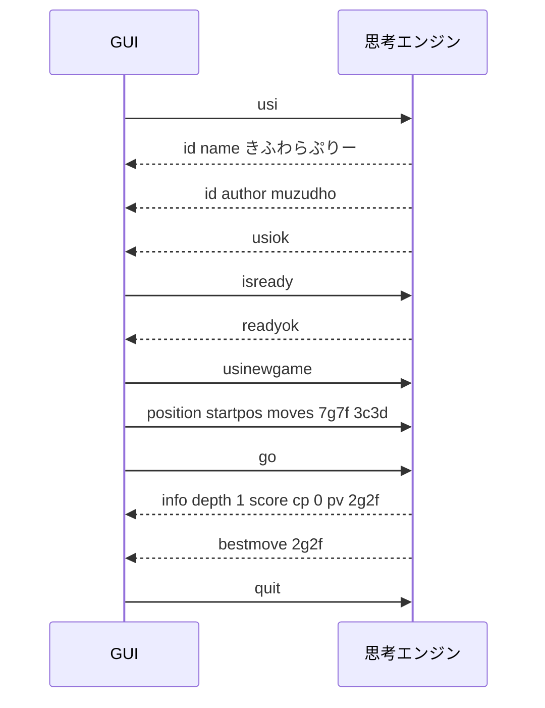
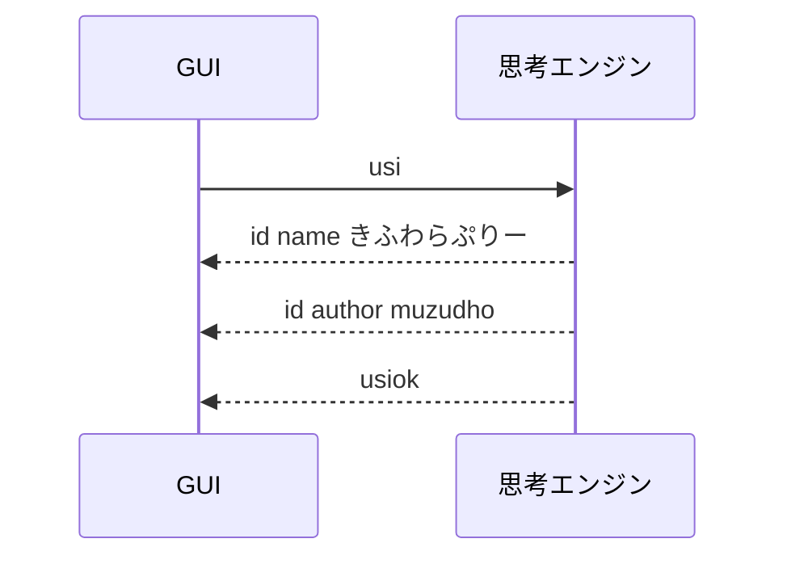
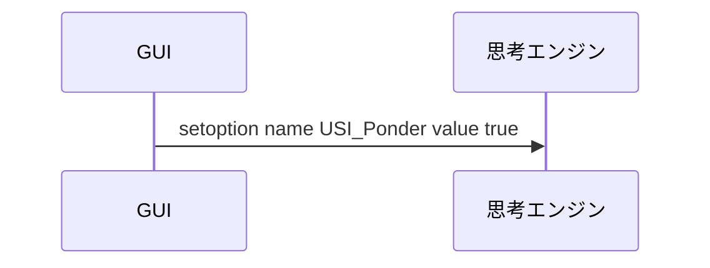
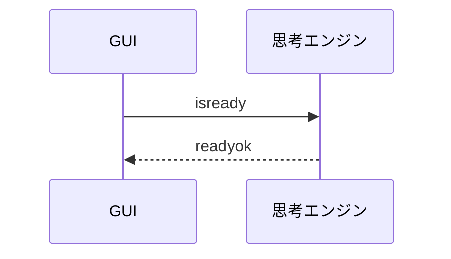
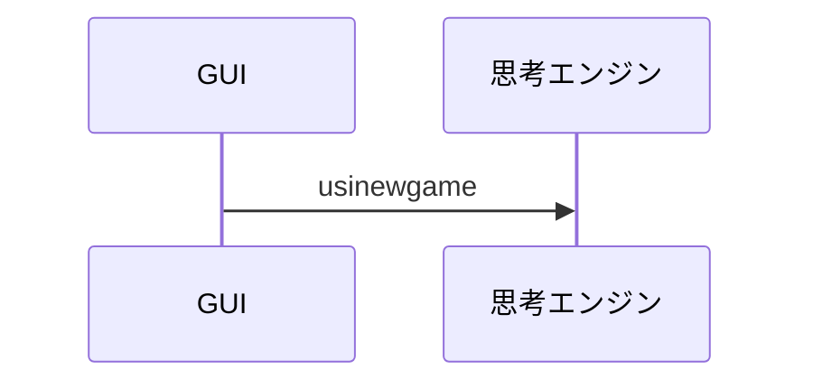
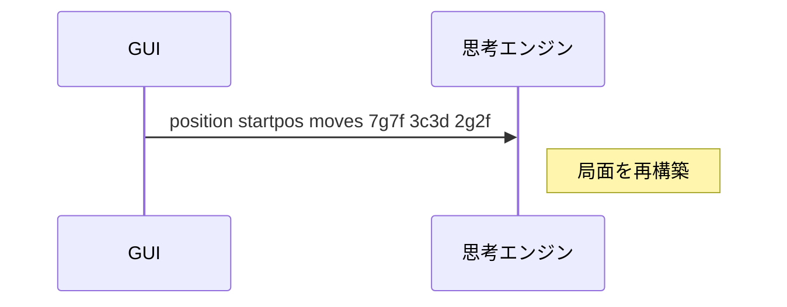
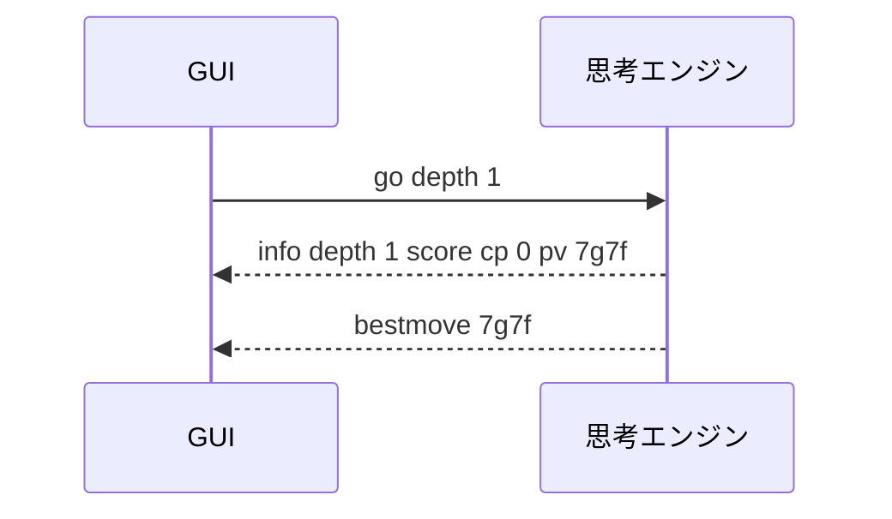
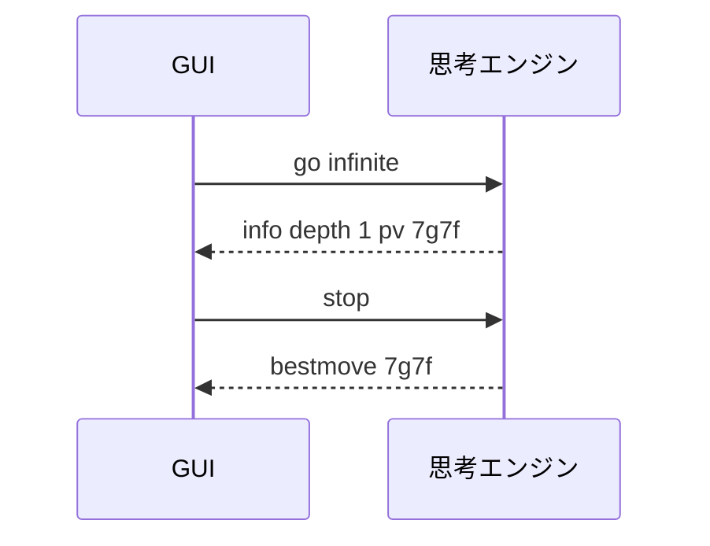
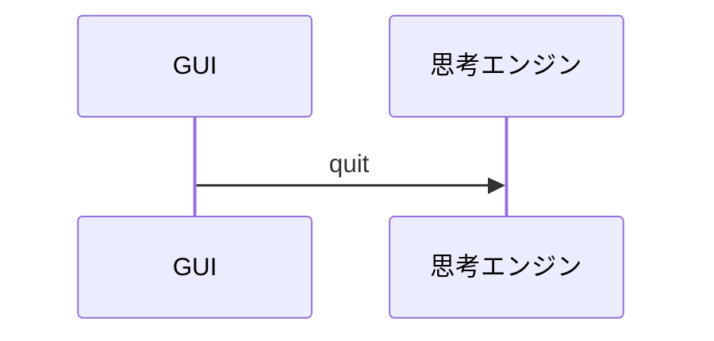

# USIプロトコルフロー

USI プロトコルのやり取りを、実装前にざっくり把握するためのメモだぜ（＾▽＾）！  
細かい SFEN の書式は、別ファイルの [📄 8_SFENメモ.md](./8_SFENメモ.md) に分けてあるぜ（＾～＾）

📖 参考： [将棋所 ＞ USIプロトコルとは](https://shogidokoro2.stars.ne.jp/usi.html)

標準出力は、将棋エンジンから GUI への通信に使うぜ（＾▽＾）！  
タイムスタンプなどの余計な装飾は付けない方がいいぜ（＾～＾）


## 全体の流れ




## 起動時



`usi` は、GUI が USI で会話を始める最初の合図だぜ（＾▽＾）！

```text
id name きふわらぷりー
id author muzudho
usiok
```

- `id name` はエンジン名だぜ
- `id author` は作者名だぜ
- `usiok` が来たら、GUI は初期化完了と判断できるぜ


## オプション宣言と設定

エンジンは `usiok` の前に `option` 行を返してもいいぜ（＾▽＾）！

```text
option name USI_Ponder type check default false
option name BookFile type string default book.db
option name SkillLevel type spin default 10 min 0 max 20
```

GUI は、そのあと `setoption` で設定を送れるぜ（＾▽＾）！



```text
setoption name USI_Ponder value true
setoption name BookFile value book.db
setoption name SkillLevel value 5
```

- `name` の後ろにオプション名を書くぜ
- `value` の後ろに設定値を書くぜ
- 最初は未対応オプションを無視する作りでもいいぜ


## 準備確認



`isready` は、対局開始前の準備確認だぜ（＾▽＾）！


## 新しいゲームの開始



前の対局の状態をクリアして、新しい対局の準備をするイメージだぜ（＾～＾）


## 局面を設定する

`position` は、これから考える局面をエンジンに伝えるコマンドだぜ（＾▽＾）！

```text
position startpos
position startpos moves 7g7f 3c3d 2g2f
position sfen <sfen文字列>
position sfen <sfen文字列> moves 7g7f 8c8d
```

- `startpos` は平手初期局面だぜ
- `sfen` は任意局面を文字列で渡す形式だぜ
- `moves` 以降は USI 形式の指し手を並べるぜ
- SFEN の詳しい説明は [📄 8_SFENメモ.md](./8_SFENメモ.md) を読んでくれだぜ




## 思考開始

`go` は「この条件で思考を始めてくれ」という指示だぜ（＾▽＾）！

```text
go
go depth 1
go movetime 1000
go btime 600000 wtime 600000 byoyomi 10000
go infinite
```

- `go` だけなら、とりあえず思考開始だぜ
- `depth` は探索深さだぜ
- `movetime` は 1 手の思考時間だぜ
- `btime` `wtime` `byoyomi` は持ち時間関係だぜ
- `infinite` は `stop` が来るまで考え続けるぜ



実装の最初は、`go` を受けたら仮で `bestmove resign` を返すだけでも往復確認には十分だぜ（＾▽＾）！


## 思考中の途中経過

`info` は GUI から送るコマンドではなく、エンジンが途中経過を返すための出力だぜ（＾▽＾）！

```text
info depth 1 score cp 0 pv 7g7f
info time 234 nodes 12345 nps 52756 pv 7g7f 3c3d
```

- `depth` は探索の深さだぜ
- `score cp` は評価値だぜ
- `pv` はいま最善と見ている読み筋だぜ
- `time` `nodes` `nps` は思考量の目安だぜ


## 思考停止

GUI は、思考中のエンジンへ `stop` を送って思考を打ち切れるぜ（＾▽＾）！



`stop` を受け取ったら、できるだけ早く `bestmove` を返すのが大事だぜ（＾～＾）


## 思考結果

思考が終わったら、最後に `bestmove` を返すぜ（＾▽＾）！

```text
bestmove 7g7f
bestmove resign
bestmove win
```

- `bestmove 7g7f` は、その手を指すぜ
- `bestmove resign` は投了だぜ
- `bestmove win` は勝ち宣言だぜ


## 対局終了通知

GUI は、対局終了時に `gameover` を送ることがあるぜ（＾▽＾）！

```text
gameover win
gameover lose
gameover draw
```

- `win` はエンジン側の勝ちだぜ
- `lose` はエンジン側の負けだぜ
- `draw` は引き分けだぜ


## 終了




## 最初の実装順

1. `usi` に対して `id name` / `id author` / `usiok` を返す
2. `isready` に対して `readyok` を返す
3. `usinewgame` を受け取れるようにする
4. `position startpos` を受け取れるようにする
5. `go` に対して仮で `bestmove resign` を返す
6. `position ... moves ...` を読めるようにする
7. `go depth` や `go movetime` を扱えるようにする
8. `info` を返せるようにする
9. `stop` を受け取って `bestmove` を返せるようにする

この順番なら、早い段階で GUI との接続確認ができるぜ（＾▽＾）！
