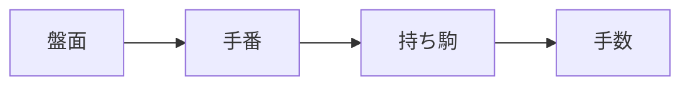
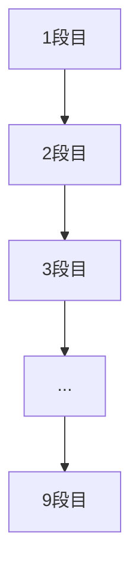
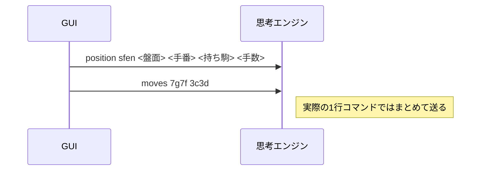

# SFENメモ

SFEN は、将棋の局面を 1 行の文字列で表す方法だぜ（＾▽＾）！  
USI の `position sfen ...` で使うので、ここでは実装前に必要な範囲を整理しておくぜ（＾～＾）


## まず全体像

`position sfen` では、だいたい次の形になるぜ。

```text
position sfen <盤面> <手番> <持ち駒> <手数>
```

例えばこんな感じだぜ。

```text
position sfen lnsgkgsnl/1r5b1/ppppppppp/9/9/9/PPPPPPPPP/1B5R1/LNSGKGSNL b - 1
```

つまり SFEN 本体は、次の 4 つでできているぜ。

1. 盤面
2. 手番
3. 持ち駒
4. 手数


## Mermaid で全体像




## 1. 盤面

盤面は、9 段を `/` 区切りで左から右へ、上段から下段へ並べるぜ（＾▽＾）！

```text
lnsgkgsnl/1r5b1/ppppppppp/9/9/9/PPPPPPPPP/1B5R1/LNSGKGSNL
```



### 駒の文字

- 小文字は後手の駒だぜ
- 大文字は先手の駒だぜ

例：

- `p` / `P` = 歩
- `l` / `L` = 香
- `n` / `N` = 桂
- `s` / `S` = 銀
- `g` / `G` = 金
- `b` / `B` = 角
- `r` / `R` = 飛
- `k` / `K` = 玉

### 空きマス

空きマスが続くところは、数字でまとめるぜ（＾▽＾）！

- `1` = 1 マス空き
- `5` = 5 マス空き
- `9` = 9 マス全部空き

例えば:

```text
9
```

これは、その段が全部空きだぜ。

### 成り駒

成り駒は、`+` を前に付けるぜ（＾▽＾）！

```text
+P
+p
+B
+r
```

- `+P` は先手のと金だぜ
- `+p` は後手のと金だぜ
- `+B` は馬だぜ
- `+r` は龍だぜ


## 2. 手番

手番は 1 文字だぜ（＾▽＾）！

```text
b
w
```

- `b` = 先手番
- `w` = 後手番


## 3. 持ち駒

持ち駒は、持っている駒を文字で並べるぜ（＾▽＾）！

```text
-
R
2Pb
```

- `-` は持ち駒なしだぜ
- `R` は先手が飛車を 1 枚持っているぜ
- `2P` は先手が歩を 2 枚持っているぜ
- `b` は後手が角を 1 枚持っているぜ

複数あるときは、枚数を前に付けるぜ。1 枚なら数字を省略するぜ（＾～＾）


## 4. 手数

最後の数字は手数だぜ（＾▽＾）！

```text
1
57
123
```

これは「何手目の局面か」を表すぜ。


## 具体例1：平手初期局面

```text
lnsgkgsnl/1r5b1/ppppppppp/9/9/9/PPPPPPPPP/1B5R1/LNSGKGSNL b - 1
```

意味はこうだぜ。

- 盤面 = 平手初期局面
- 手番 = `b` なので先手番
- 持ち駒 = `-` なのでなし
- 手数 = `1`


## 具体例2：途中局面

```text
lnsgkgsnl/1r5b1/pppp1pppp/4p4/9/4P4/PPPP1PPPP/1B5R1/LNSGKGSNL w - 2
```

これは例えば、

- 先手が 5 七の歩を 5 六へ進めた
- 後手が 5 三の歩を 5 四へ進めた

みたいな途中局面を表せるぜ（＾▽＾）！


## position コマンドとの関係

USI では、SFEN はたいてい `position` コマンドの中で使うぜ。

```text
position sfen lnsgkgsnl/1r5b1/ppppppppp/9/9/9/PPPPPPPPP/1B5R1/LNSGKGSNL b - 1
```

さらに、その局面から続きの指し手を追加できるぜ。

```text
position sfen lnsgkgsnl/1r5b1/ppppppppp/9/9/9/PPPPPPPPP/1B5R1/LNSGKGSNL b - 1 moves 7g7f 3c3d
```




## 実装メモ

最初の実装では、全部を一気に対応しなくてもいいぜ（＾～＾）

1. まず `position startpos` を読めるようにする
2. 次に `position startpos moves ...` を読めるようにする
3. そのあと `position sfen ...` を読めるようにする
4. 最後に、成り駒や持ち駒打ちも含めて厳密にする

学習用なら、この順番の方が追いやすいぜ（＾▽＾）！
